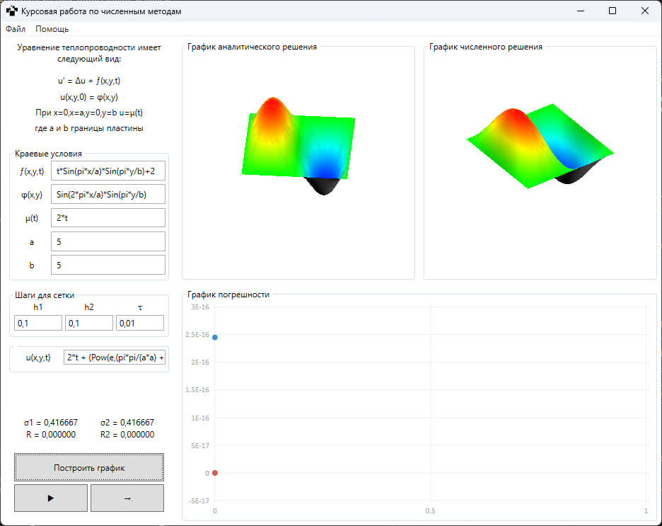

# NumericalPlate

Initial boundary value problem for the heat equation in a rectangle. Construction of circuits of a higher order of accuracy.

Construction of a circuit with approximation accuracy $O(h_1^4+h_2^4+\tau^2)$.

NumericalPlate app is implementation of an economical difference scheme, combining properties of both explicit,
and implicit schemes. the scheme is absolutely stable.

More about construction of scheme: [Report [RUS]](./docs/report.pdf)

App include tests mentioned on report.

## Dependencies

* WPF 3D charts - [High performance WPF 3D Chart](https://www.codeproject.com/Articles/42174/High-performance-WPF-3D-Chart). Thx to [Jianzhong Zhang](https://www.codeproject.com/script/Membership/View.aspx?mid=914481).
* Math expr parse - [CoreCLR-NCalc](https://www.nuget.org/packages/CoreCLR-NCalc/)
* Other Plots - [LiveCharts](https://www.nuget.org/packages/LiveCharts) and [LiveCharts](https://www.nuget.org/packages/LiveCharts.Wpf)
